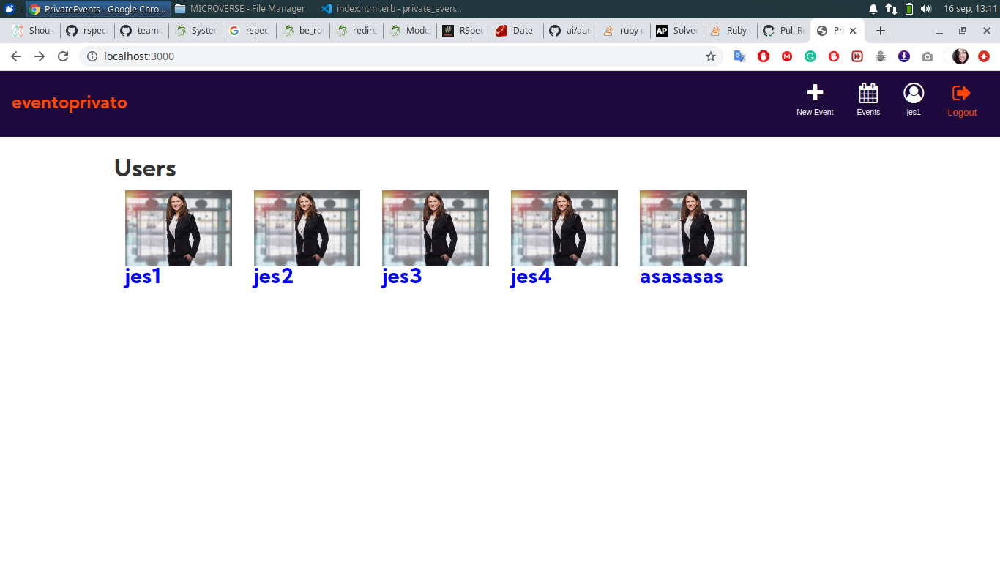

<!-- PROJECT LOGO -->
# Private Events: Evento Privato
This Project is an app built using Ruby on Rails meant to mimick the functionality of Eventbrite. This rails app was built to implement the creation of Private Events a Web app where you can create an event, "buy" your attendance for an event while being signed in by simply using your username.

<!-- TABLE OF CONTENTS -->
## Table of Contents
- [Private Events: EventoPrivato](#private-events-evento-privato)
  - [Table of Contents](#table-of-contents)
- [About The Project](#about-the-project)
- [Getting started](#getting-started)
  - [Installation](#installation)
  - [Features:](#features)
  - [Ruby Gems used in this project](#ruby-gems-used-in-this-project)
- [Authors](#authors)
- [Acknowledgements](#acknowledgements)
  - [Show your support](#show-your-support)
<!-- ABOUT THE PROJECT -->
# About The Project
This Project is an app built using Ruby on Rails meant to mimick the functionality of Eventbrite. This rails app was built to implement the creation of Private Events a Web app where you can create an event, "buy" your attendance for an event while being signed in by simply using your username.
This project demonstrates a User Role system giving the web application and native application feel all within the browser. We used Rails generators to help scaffold views. The app features the CRUD principle where we create & read Events.

<!-- GETTING STARTED -->
# Getting started
## Installation
* Clone the repo following [this link](https://github.com/aracelicaes/private_events)
* Install all dependencies running from terminal using the command <pre><code>bundle install
</code></pre>
* Run from terminal <pre><code>bin/rails server
</code></pre>

## Features:
* Ruby 2.7.0
* Rubocop
* Ruby Gems
* Postgresql

## Ruby Gems used in this project

* [Bootstrap](https://getbootstrap.com/) - SCSS Framework
* [Font-Awesome](https://fontawesome.com/) - For SASS icons

<!-- CONTACT -->
# Authors
👤 **Ara Camarillo**https://www.theodinproject.com/courses/ruby-on-rails/lessons/associations?ref=lnav

- Github: [aracelicaes](https://github.com/aracelicaes)
- Twitter: [@Ara_CE_93](https://twitter.com/Ara_CE_93)
- Linkedin: [Ara Camarillo](www.linkedin.com/in/ara-camarillo)

👤 **Jessica Farias**

- Github: [jessicafarias](https://github.com/jessicafarias)
- Twitter: [@FariasRosado](https://twitter.com/FariasRosado)
- Linkedin: [jessica-michelle-farias-rosado](https://www.linkedin.com/in/jessica-michelle-farias-rosado/)

📄 **Project Link: [Click Here](https://github.com/aracelicaes/private_events)**
<!-- ACKNOWLEDGEMENTS -->
# Acknowledgements
- [Microverse](https://microverse.org)
- [Best-README-Template](https://github.com/othneildrew/Best-README-Template)
- [Rails Guides](https://guides.rubyonrails.org/)
- [The Odin Project](https://www.theodinproject.com/courses/ruby-on-rails/lessons/associations?ref=lnav)

## Show your support

Give a ⭐️ if you like this project!
